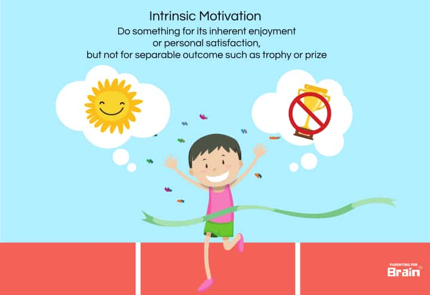

### Nine lessons from the book "Fit For Success (by Nick Shaw)"

1. A person's mindset is one of the key pillars of success. **With the right mindset, everyone can be successful**.

2. A **strong work ethic** is critical since success is only possible through hard work.

3. An **optimistic mindset** increases your chances of success.

4. **Intrinsic motivation** is critical to success because it's
   literally what keeps people going.

5. External motivations like money or material possessions are okay but have a shorter effectiveness period.

6. The thing that differentiates successful people from the masses is discipline. It's the commitment to do what is necessary no matter what.

7. Successful people have many related abilities: the ability to work hard, the desire to do it, and the commitment to follow through on it.

8. On earning success: you must be ready to work, eager to work hard, and to see that work through to its completion

9. Realize that not every day will be great, but every day is an opportunity to get closer to where someone wants to be, whether motivated or not.
